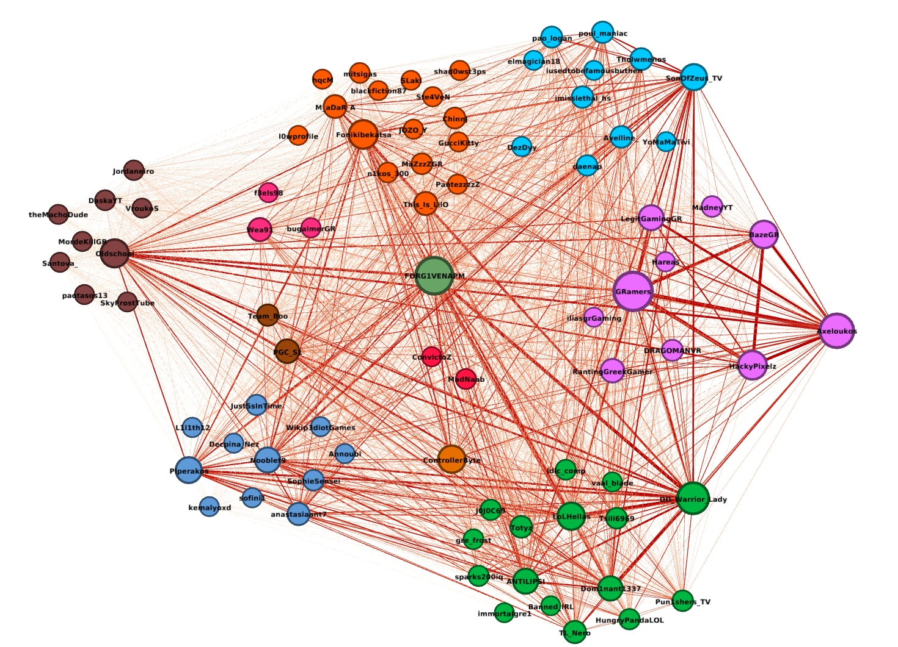

# Twitch Graph Analysis

Twitch.tv is the biggest livestreaming platform on the internet. More than 15 million unique viewers tune in everyday to watch their favourite broadcasters. This rapid growth has led to the emergence of massive social communities for users to be part of and actively participate in. These communities continue to grow and dynamically change over time as Twitch becomes more popular, creating space for Big Data applications to emerge. In this paper we propose an architecture for a Big Data system that captures these communities and how they evolve over time. We validate the system by performing analysis on the Greek community and finally propose an architecture to address scalability issues.

The report can be found [here](./report.pdf).

